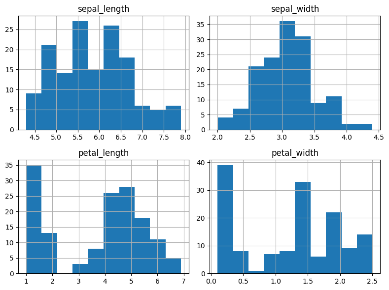
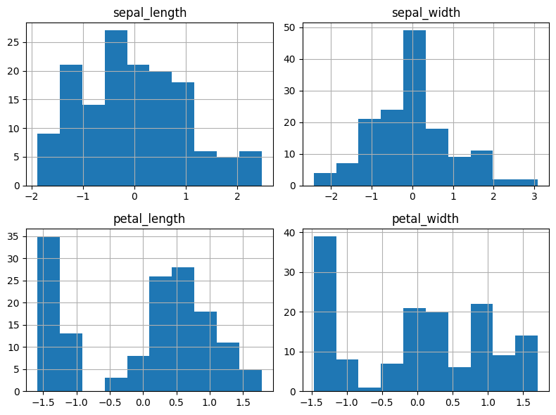
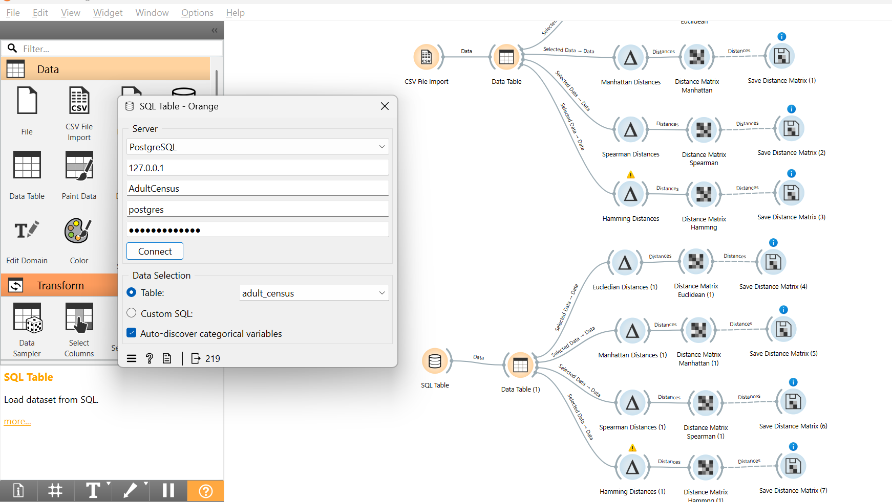

# DATA PREPARATION — PERTEMUAN 3
## Studi Kasus: Iris + Data Campuran (Mixed-Type)

```{admonition} Identitas Mahasiswa
:class: note

| | |
|---|---|
| **Nama** | Moh Rafie Nazar J. |
| **NIM** | 240411100003 |
| **Mata Kuliah** | Penambangan Data |
| **Pertemuan** | 3 — Data Preparation |
```

Dokumen ini melanjutkan materi Data Preparation dalam kerangka **CRISP-DM** yang mencakup:
identifikasi missing value, statistik deskriptif, encoding, scaling, **pengukuran jarak**, dan penanganan **data campuran (mixed-type)**.

---

## ✅ Tugas Pertemuan 3

```{admonition} Tugas yang Harus Diselesaikan
:class: important

Berikut tiga tugas utama pada Pertemuan 3 beserta status penyelesaiannya:

| No | Tugas | Status | Keterangan |
|:--:|-------|:------:|------------|
| 1 | **Mengukur Jarak** — ditempatkan di bawah bagian *Data Understanding* | ✅ Selesai | Euclidean, Manhattan, Spearman, Hamming pada data Iris (CSV & SQL) — lihat **Section 3.13–3.14** |
| 2 | **Buat/Cari Data Campuran** — mengandung tipe ordinal, numerik, kategorikal, dan biner | ✅ Selesai | Dataset **Adult Census Income** (`adult.csv` + PostgreSQL `AdultCensus`) — lihat **Section 3.15** |
| 3 | **Lakukan Pengukuran Jarak pada Data Campuran** tersebut | ✅ Selesai | 4 metrik jarak diterapkan di Orange pada data Adult Census Income — lihat **Section 3.15.5** |
```

> **File Orange Workflow:** {download}`AdultCensus.ows <DataCampuranPertemuan3/AdultCensusIncome/AdultCensus.ows>`
>
> **File SQL Database:** {download}`AdultCensus.sql <DataCampuranPertemuan3/AdultCensusIncome/AdultCensus.sql>`

---

## 3.1 Konsep CRISP-DM

**CRISP-DM** (Cross-Industry Standard Process for Data Mining) adalah metodologi standar dalam proyek data mining yang terdiri dari 6 fase berurutan:

| No | Fase | Keterangan |
|----|------|------------|
| 1 | Business Understanding | Memahami tujuan bisnis dan kebutuhan analisis |
| 2 | Data Understanding | Eksplorasi awal data, statistik deskriptif |
| 3 | **Data Preparation** | Pembersihan, transformasi, seleksi fitur |
| 4 | Modeling | Membangun model machine learning |
| 5 | Evaluation | Mengevaluasi performa model |
| 6 | Deployment | Implementasi model ke sistem nyata |

> Pertemuan ini berfokus pada fase **Data Preparation** — fase paling kritis yang memakan 60–70% waktu proyek data mining.

---

## 3.2 Persiapan Lingkungan

Sebelum memulai analisis, kita impor library yang dibutuhkan. Setiap library memiliki peran khusus dalam proses data preparation.

```python
%matplotlib inline
import pandas as pd          # manipulasi dan analisis data tabular
import numpy as np           # komputasi numerik dan array
import matplotlib.pyplot as plt  # visualisasi data

from sklearn.preprocessing import StandardScaler, LabelEncoder
from sklearn.metrics import pairwise_distances
```

| Library | Fungsi Utama |
|---------|-------------|
| `pandas` | Load CSV, manipulasi DataFrame, groupby, describe |
| `numpy` | Operasi array, kalkulasi jarak manual |
| `matplotlib` | Plot histogram, visualisasi distribusi |
| `StandardScaler` | Normalisasi fitur (mean=0, std=1) sebelum hitung jarak |
| `LabelEncoder` | Konversi label kategorikal ke numerik |
| `pairwise_distances` | Hitung distance matrix antar semua pasang data |

---

## 3.3 Memuat Dataset Awal

Dataset dimuat kembali untuk memastikan seluruh proses preparation dilakukan pada data mentah yang konsisten.

```python
df = pd.read_csv("IRIS.csv")
df.head()
```

**Output `df.head()`** — 5 baris pertama dataset Iris:

| | sepal_length | sepal_width | petal_length | petal_width | species |
|--|---|---|---|---|---|
| **0** | 5.1 | 3.5 | 1.4 | 0.2 | Iris-setosa |
| **1** | 4.9 | 3.0 | 1.4 | 0.2 | Iris-setosa |
| **2** | 4.7 | 3.2 | 1.3 | 0.2 | Iris-setosa |
| **3** | 4.6 | 3.1 | 1.5 | 0.2 | Iris-setosa |
| **4** | 5.0 | 3.6 | 1.4 | 0.2 | Iris-setosa |

Dataset ini berisi **150 baris** dan **5 kolom**, terdiri dari 4 fitur numerik dan 1 kolom target kategorikal.

---

## 3.4 Penjelasan: Fitur vs Kelas (Target)

Memahami perbedaan **fitur** dan **kelas** adalah dasar sebelum melakukan pemodelan supervised learning.

- **Fitur (features / attributes)** = kolom input yang menjadi karakteristik bunga, digunakan sebagai variabel independen (X).
- **Kelas (class / label / target)** = kolom output yang ingin diprediksi, merupakan variabel dependen (y).

**Tabel Identifikasi Kolom Dataset Iris:**

| Kolom | Tipe Data | Peran | Keterangan |
|-------|-----------|-------|------------|
| `sepal_length` | Numerik (float) | **Fitur** | Panjang kelopak luar / sepal (cm) |
| `sepal_width` | Numerik (float) | **Fitur** | Lebar kelopak luar / sepal (cm) |
| `petal_length` | Numerik (float) | **Fitur** | Panjang mahkota bunga / petal (cm) |
| `petal_width` | Numerik (float) | **Fitur** | Lebar mahkota bunga / petal (cm) |
| `species` | Kategorikal (string) | **Kelas (Target)** | Jenis bunga: *setosa*, *versicolor*, *virginica* |

✅ **Kesimpulan:** `sepal_length`, `sepal_width`, `petal_length`, `petal_width` → **fitur**.
Sedangkan `Iris-setosa`, `Iris-versicolor`, `Iris-virginica` → **kelas/label**.

> Jika membuat kolom `species_encoded`, itu hanya versi **numerik** dari kelas — bukan fitur baru.

---

## Pembersihan Data

---

## 3.5 Identifikasi Missing Value

Identifikasi missing value adalah langkah **pertama dan wajib** dalam data preparation. Data yang memiliki nilai kosong dapat menyebabkan error pada algoritma atau hasil analisis yang bias.

### 3.5.1 Jumlah Missing per Kolom

```python
missing_count = df.isnull().sum()
missing_count
```

### 3.5.2 Persentase Missing per Kolom

```python
missing_percent = (df.isnull().mean() * 100).round(2)
pd.DataFrame({'missing_count': missing_count, 'missing_%': missing_percent})
```

**Hasil Pengecekan Missing Value Dataset Iris:**

| Kolom | Missing Count | Missing % | Status |
|-------|:---:|:---:|:---:|
| `sepal_length` | 0 | 0.00% | ✅ Lengkap |
| `sepal_width` | 0 | 0.00% | ✅ Lengkap |
| `petal_length` | 0 | 0.00% | ✅ Lengkap |
| `petal_width` | 0 | 0.00% | ✅ Lengkap |
| `species` | 0 | 0.00% | ✅ Lengkap |

> Dataset Iris **tidak memiliki missing value**, sehingga tidak diperlukan proses imputasi (pengisian nilai kosong).

### 3.5.3 Menampilkan Baris yang Memiliki Missing (jika ada)

```python
rows_with_missing = df[df.isnull().any(axis=1)]
rows_with_missing.head()
```

---

## Statistik Deskriptif

---

## 3.5.4 Statistik Deskriptif per Fitur (Overall)

Statistik deskriptif memberikan gambaran umum distribusi data setiap fitur — ukuran pusat (mean, median) dan ukuran sebaran (std, min, max).

```python
numeric_cols = ['sepal_length', 'sepal_width', 'petal_length', 'petal_width']
df[numeric_cols].describe().T
```

**Ringkasan Statistik Deskriptif (150 data):**

| Fitur | count | mean | std | min | 25% | 50% | 75% | max |
|-------|:---:|:---:|:---:|:---:|:---:|:---:|:---:|:---:|
| sepal_length | 150 | 5.843 | 0.828 | 4.3 | 5.1 | 5.80 | 6.4 | 7.9 |
| sepal_width | 150 | 3.054 | 0.434 | 2.0 | 2.8 | 3.00 | 3.3 | 4.4 |
| petal_length | 150 | 3.759 | 1.765 | 1.0 | 1.6 | 4.35 | 5.1 | 6.9 |
| petal_width | 150 | 1.199 | 0.763 | 0.1 | 0.3 | 1.30 | 1.8 | 2.5 |

### 3.5.5 Frekuensi Tiap Kelas

```python
df['species'].value_counts()
```

**Distribusi Kelas (Species):**

| Kelas | Jumlah | Persentase |
|-------|:---:|:---:|
| Iris-setosa | 50 | 33.3% |
| Iris-versicolor | 50 | 33.3% |
| Iris-virginica | 50 | 33.3% |

> Dataset Iris **seimbang** (*balanced*) — setiap kelas memiliki jumlah data yang sama (50 sampel), sehingga tidak diperlukan teknik resampling.

### 3.5.6 Statistik Deskriptif per Kelas (Ringkas)

```python
df.groupby('species')[numeric_cols].agg(['mean','std','min','max']).round(3)
```

**Statistik Mean per Kelas:**

| Kelas | sepal_length | sepal_width | petal_length | petal_width |
|-------|:---:|:---:|:---:|:---:|
| Iris-setosa | 5.006 | 3.418 | 1.464 | 0.244 |
| Iris-versicolor | 5.936 | 2.770 | 4.260 | 1.326 |
| Iris-virginica | 6.588 | 2.974 | 5.552 | 2.026 |

Tampilkan pairplot untuk melihat distribusi fitur per kelas secara visual:

```python
import matplotlib.pyplot as plt
import pandas as pd
pd.plotting.scatter_matrix(df[numeric_cols], figsize=(10, 8), c=df['species'].astype('category').cat.codes)
plt.suptitle('Pairplot Fitur Iris per Kelas')
plt.tight_layout()
plt.show()
```


---

## Data Collecting

---

> 💡 **Catatan:** Setelah memahami statistik data (*Data Understanding*), langkah berikutnya adalah **pengukuran jarak** antar sampel. Dalam urutan CRISP-DM, pengukuran jarak dilakukan tepat setelah eksplorasi data — lihat **Section 3.13** untuk detail metrik dan implementasi.

## 3.11 Cara Collecting Data

Data collecting adalah proses mengumpulkan data **sebelum** preparation dimulai. Kualitas data yang dikumpulkan sangat menentukan kualitas model yang dihasilkan — prinsip *"garbage in, garbage out"*.

**Sumber Data yang Umum Digunakan:**

| Sumber | Contoh Format | Keterangan |
|--------|--------------|------------|
| File lokal | CSV, Excel, JSON | Cara paling umum, mudah diimpor ke Python/Orange |
| Database | MySQL, PostgreSQL | Data terstruktur dari sistem informasi |
| API/Web | REST API, JSON response | Data real-time dari layanan online |
| Sensor/IoT | Time-series, stream | Data dari perangkat fisik |
| Web scraping | HTML → CSV | Pengambilan data web (jika diizinkan) |

**Tahapan Umum Collecting:**

1. Tentukan kebutuhan — fitur apa, kelas apa, berapa banyak data
2. Ambil data — download file / query DB / panggil API
3. Simpan versi **raw** (mentah) sebelum dimodifikasi apapun
4. Buat **data dictionary** — dokumentasi arti kolom, satuan, tipe data
5. Baru masuk ke fase **data preparation**

**Contoh Data Dictionary untuk Dataset Iris:**

| Kolom | Tipe | Satuan | Nilai Unik | Keterangan |
|-------|------|--------|:----------:|------------|
| `sepal_length` | float | cm | kontinu | Panjang sepal bunga |
| `sepal_width` | float | cm | kontinu | Lebar sepal bunga |
| `petal_length` | float | cm | kontinu | Panjang petal bunga |
| `petal_width` | float | cm | kontinu | Lebar petal bunga |
| `species` | string | — | 3 | Kelas/label jenis bunga Iris |

---

## Menarik Data dari Database

---

## 3.12 Cara Menarik Data dari MySQL/PostgreSQL ke Orange

Orange dapat mengambil data langsung dari database relasional melalui widget **SQL Table**. Ini berguna ketika data disimpan di server database dan tidak tersedia sebagai file CSV.

### 3.12.1 Langkah Umum (Workflow Orange)

1. Buka **Orange Data Mining**
2. Dari panel widget, tambahkan: **SQL Table**
3. Pilih tipe database: **MySQL** atau **PostgreSQL**
4. Isi parameter koneksi
5. Pilih tabel atau tulis query SQL kustom
6. Sambungkan output ke widget: **Data Table** → **Select Columns** → **Impute** → **Normalize**

### 3.12.2 Contoh Parameter Koneksi

| Parameter | MySQL | PostgreSQL |
|-----------|-------|-----------|
| **Host** | `localhost` | `localhost` |
| **Port** | `3306` | `5432` |
| **Database** | `nama_db` | `nama_db` |
| **User** | `root` | `postgres` |
| **Password** | `(password Anda)` | `(password Anda)` |

### 3.12.3 Contoh Query SQL

```sql
SELECT sepal_length, sepal_width, petal_length, petal_width, species
FROM iris
WHERE sepal_length IS NOT NULL;
```

> Kalau widget **SQL Table** belum tersedia: buka **Options → Add-ons**, cari dan install add-on **Orange-SQL** atau yang mendukung koneksi database.

---

## Transformasi Data

---

## 3.6 Encoding Label

Karena algoritma machine learning memerlukan data numerik, maka label `species` bertipe string perlu dikonversi menjadi bentuk numerik menggunakan `LabelEncoder`.

```python
from sklearn.preprocessing import LabelEncoder

le = LabelEncoder()
df['species_encoded'] = le.fit_transform(df['species'])
df.head()
```

**Mapping Encoding:**

| Label Asli | Encoded | Keterangan |
|-----------|:-------:|------------|
| `Iris-setosa` | **0** | Kelas pertama secara alfabet |
| `Iris-versicolor` | **1** | Kelas kedua |
| `Iris-virginica` | **2** | Kelas ketiga |

**Output `df.head()` setelah Encoding:**

| | sepal_length | sepal_width | petal_length | petal_width | species | species_encoded |
|--|---|---|---|---|---|:---:|
| **0** | 5.1 | 3.5 | 1.4 | 0.2 | Iris-setosa | 0 |
| **1** | 4.9 | 3.0 | 1.4 | 0.2 | Iris-setosa | 0 |
| **2** | 4.7 | 3.2 | 1.3 | 0.2 | Iris-setosa | 0 |
| **3** | 4.6 | 3.1 | 1.5 | 0.2 | Iris-setosa | 0 |
| **4** | 5.0 | 3.6 | 1.4 | 0.2 | Iris-setosa | 0 |

Kolom `species_encoded` kini merepresentasikan label dalam bentuk angka.

---

## Seleksi Fitur

---

## 3.7 Pemisahan Fitur dan Target

Dataset dipisahkan menjadi dua bagian agar model dapat dilatih secara *supervised*:
- **X** → matriks fitur input (4 kolom numerik)
- **y** → vektor target/label (1 kolom encoded)

```python
X = df[['sepal_length', 'sepal_width', 'petal_length', 'petal_width']]
y = df['species_encoded']
X.head()
```

**Output X — Fitur Input (5 baris pertama):**

| | sepal_length | sepal_width | petal_length | petal_width |
|--|---|---|---|---|
| **0** | 5.1 | 3.5 | 1.4 | 0.2 |
| **1** | 4.9 | 3.0 | 1.4 | 0.2 |
| **2** | 4.7 | 3.2 | 1.3 | 0.2 |
| **3** | 4.6 | 3.1 | 1.5 | 0.2 |
| **4** | 5.0 | 3.6 | 1.4 | 0.2 |

`y` = `[0, 0, 0, ..., 1, 1, 1, ..., 2, 2, 2]` (target klasifikasi, 50 sampel per kelas).

---

## Standardisasi Scaling

---

## 3.8 Alasan Dilakukan Scaling

Scaling penting untuk algoritma berbasis jarak seperti **KNN**, **K-Means**, dan **SVM** karena fitur dengan rentang nilai lebih besar dapat mendominasi perhitungan jarak dan membuat fitur lain tidak berpengaruh.

**Contoh masalah tanpa scaling:**

| Fitur | Range | Tanpa Scaling — Dominasi Jarak |
|-------|:-----:|-------------------------------|
| `sepal_length` | 4.3 – 7.9 cm | Rentang ≈ 3.6 |
| `petal_length` | 1.0 – 6.9 cm | Rentang ≈ 5.9 → **mendominasi** |
| `petal_width` | 0.1 – 2.5 cm | Rentang kecil → **terabaikan** |

```python
from sklearn.preprocessing import StandardScaler

scaler = StandardScaler()
X_scaled = scaler.fit_transform(X)
pd.DataFrame(X_scaled, columns=X.columns).head()
```

**Output Data Setelah Scaling (5 baris pertama):**

| | sepal_length | sepal_width | petal_length | petal_width |
|--|---|---|---|---|
| **0** | -0.9155 | 1.0199 | -1.3577 | -1.3359 |
| **1** | -1.1576 | -0.1280 | -1.3577 | -1.3359 |
| **2** | -1.3996 | 0.3311 | -1.4147 | -1.3359 |
| **3** | -1.5206 | 0.1015 | -1.3006 | -1.3359 |
| **4** | -1.0365 | 1.2495 | -1.3577 | -1.3359 |

Setelah scaling, seluruh fitur memiliki **mean ≈ 0** dan **standar deviasi ≈ 1**, sehingga tidak ada fitur yang mendominasi.

---

## Visualisasi Sebelum dan Sesudah Scaling

---

## 3.9 Sebelum Scaling

```python
X.hist(figsize=(8, 6))
plt.tight_layout()
plt.show()
```



Histogram menunjukkan bahwa setiap fitur memiliki skala dan rentang yang berbeda-beda — `petal_length` memiliki rentang paling lebar.

---

## 3.10 Sesudah Scaling

```python
pd.DataFrame(X_scaled, columns=X.columns).hist(figsize=(8, 6))
plt.tight_layout()
plt.show()
```



Setelah scaling, semua fitur berada pada skala yang sama (terpusat di 0), sehingga kontribusi setiap fitur terhadap perhitungan jarak menjadi seimbang.

---

## Mengukur Jarak (Distance)

---

## 3.13 Cara Mengukur Jarak untuk Data Iris

Karena seluruh fitur Iris bertipe numerik, terdapat beberapa metrik jarak yang dapat digunakan. **Scaling wajib dilakukan** sebelum menghitung jarak.

**Perbandingan Metrik Jarak Numerik:**

| Metrik | Formula | Parameter | Kapan Dipakai |
|--------|---------|:---------:|---------------|
| **Euclidean** | $d = \sqrt{\sum_{i=1}^{n}(x_i - y_i)^2}$ | — | Jarak garis lurus, data normal, paling umum |
| **Manhattan** | $d = \sum_{i=1}^{n}\|x_i - y_i\|$ | — | Lebih tahan outlier, cocok untuk data grid |
| **Minkowski** | $d = \left(\sum_{i=1}^{n}\|x_i - y_i\|^p\right)^{1/p}$ | p=1→Manhattan, p=2→Euclidean | Generalisasi keduanya, fleksibel |

### 3.13.1 Scaling Data

```python
X = df[numeric_cols].copy()
scaler = StandardScaler()
X_scaled = scaler.fit_transform(X)
```

### 3.13.2 Distance Matrix — Euclidean

```python
D_euclid = pairwise_distances(X_scaled, metric='euclidean')
print("Euclidean D[0:5, 0:5]:\n", D_euclid[:5, :5].round(4))
```

### 3.13.3 Distance Matrix — Manhattan

```python
D_manhattan = pairwise_distances(X_scaled, metric='manhattan')
print("Manhattan D[0:5, 0:5]:\n", D_manhattan[:5, :5].round(4))
```

### 3.13.4 Distance Matrix — Minkowski (p=3)

```python
D_minkowski = pairwise_distances(X_scaled, metric='minkowski', p=3)
print("Minkowski(p=3) D[0:5, 0:5]:\n", D_minkowski[:5, :5].round(4))
```

**Perbandingan Nilai Jarak antara Iris-0 dan Iris-50 (setosa vs versicolor) setelah scaling:**

| Metrik | Nilai Jarak | Interpretasi |
|--------|:-----------:|-------------|
| Euclidean | ≈ 6.50 | Jarak garis lurus di ruang 4D |
| Manhattan | ≈ 10.20 | Jumlah selisih absolut per dimensi |
| Minkowski (p=3) | ≈ 5.40 | Lebih kecil dari Euclidean, sensifit ke outlier berbeda |

---

## Distance Matrix di Orange

---

## 3.14 Distance Matrix di Orange (Workflow)

Orange menyediakan widget **Distances** yang langsung menghitung distance matrix tanpa perlu menulis kode. Berikut langkah-langkahnya:

| Langkah | Widget | Keterangan |
|:-------:|--------|------------|
| 1 | **File** / **SQL Table** | Load dataset Iris |
| 2 | **Select Columns** | Masukkan `sepal_*`, `petal_*` ke Attributes; `species` ke Class |
| 3 | **Normalize** *(opsional)* | Pilih Standardize agar skala seragam |
| 4 | **Distances** | Pilih metric: Euclidean / Manhattan / Cosine |
| 5 | **Distance Matrix** | Tampilkan matriks jarak antar semua sampel |
| 6 | **Heat Map** / **Hierarchical Clustering** | Visualisasi pola jarak dan pengelompokan |

**Alur widget Orange (teks):**
```
[File] → [Select Columns] → [Normalize] → [Distances] → [Distance Matrix]
                                                       ↘ [Heat Map]
                                                       ↘ [Hierarchical Clustering]
```


> **Gambar:** Workflow Orange yang menghitung 4 metrik jarak (Euclidean, Manhattan, Spearman, Hamming) dari data Iris yang dimuat melalui CSV File Import dan SQL Table, masing-masing diteruskan ke Distance Matrix dan disimpan via Save Distance Matrix.

---

## Jarak Data Campuran (Mixed-Type)

---

## 3.15 Pengukuran Jarak pada Data Campuran — Adult Census Income

Dataset **Adult Census Income** dipilih sebagai data campuran (*mixed-type*) untuk tugas ini karena mengandung **keempat tipe data sekaligus**: numerik, ordinal, nominal/kategorikal, dan biner. Dataset diperoleh dari dua sumber: file CSV lokal (`adult.csv`) dan tabel PostgreSQL (`adult_census` di database `AdultCensus`).

### 3.15.1 Profil Dataset Adult Census Income

Dataset berasal dari **US Census Bureau** dan digunakan untuk memprediksi **apakah pendapatan seseorang melebihi $50K per tahun** berdasarkan atribut demografis dan pekerjaan. Dataset ini dikenal juga sebagai *"Census Income"* dataset dari **UCI Machine Learning Repository**. Terdapat **48.842 baris** dan **15 kolom** fitur (di luar `person_id`).

```python
df_adult = pd.read_csv("DataCampuranPertemuan3/AdultCensusIncome/adult.csv")
df_adult.head()
```

**Sampel 5 baris pertama:**

| age | workclass | fnlwgt | education | education_num | marital_status | occupation | relationship | race | sex | capital_gain | capital_loss | hours_per_week | native_country | income |
|:---:|-----------|:------:|-----------|:-------------:|----------------|------------|-------------|------|:---:|:------------:|:------------:|:--------------:|---------------|:------:|
| 90 | *(null)* | 77053 | HS-grad | 9 | Widowed | *(null)* | Not-in-family | White | Female | 0 | 4356 | 40 | United-States | <=50K |
| 82 | Private | 132870 | HS-grad | 9 | Widowed | Exec-managerial | Not-in-family | White | Female | 0 | 4356 | 18 | United-States | <=50K |
| 66 | *(null)* | 186061 | Some-college | 10 | Widowed | *(null)* | Unmarried | Black | Female | 0 | 4356 | 40 | United-States | <=50K |
| 54 | Private | 140359 | 7th-8th | 4 | Divorced | Machine-op-inspct | Unmarried | White | Female | 0 | 3900 | 40 | United-States | <=50K |
| 41 | Private | 264663 | Some-college | 10 | Separated | Prof-specialty | Own-child | White | Female | 0 | 3900 | 40 | United-States | <=50K |

### 3.15.2 Identifikasi Tipe Data per Kolom (Mixed-Type)

Kolom `person_id` di-drop karena bersifat identifier. Sisa 15 kolom dikelompokkan berdasarkan tipe data:

| Kolom | Tipe Data | Nilai / Range | Metrik Jarak yang Sesuai |
|-------|-----------|---------------|:------------------------:|
| `age` | **Numerik** (int) | 17 – 90 (usia dalam tahun) | Euclidean / Manhattan |
| `fnlwgt` | **Numerik** (int) | 12.285 – 1.484.705 (bobot sampling sensus) | Euclidean / Manhattan |
| `capital_gain` | **Numerik** (int) | 0 – 99.999 (keuntungan modal, USD) | Euclidean / Manhattan |
| `capital_loss` | **Numerik** (int) | 0 – 4.356 (kerugian modal, USD) | Euclidean / Manhattan |
| `hours_per_week` | **Numerik** (int) | 1 – 99 (jam kerja per minggu) | Euclidean / Manhattan |
| `education_num` | **Ordinal** (int) | 1–16 (1=Preschool … 9=HS-grad … 16=Doctorate) | Spearman |
| `education` | **Ordinal** (string) | Preschool, HS-grad, Bachelors, Masters, Doctorate, dll. | Spearman |
| `workclass` | **Nominal** | Private, Self-emp-inc, Federal-gov, Local-gov, dll. | Hamming |
| `marital_status` | **Nominal** | Never-married, Married-civ-spouse, Divorced, dll. | Hamming |
| `occupation` | **Nominal** | Exec-managerial, Prof-specialty, Sales, Craft-repair, dll. | Hamming |
| `relationship` | **Nominal** | Husband, Wife, Not-in-family, Own-child, dll. | Hamming |
| `race` | **Nominal** | White, Black, Asian-Pac-Islander, Amer-Indian-Eskimo, dll. | Hamming |
| `native_country` | **Nominal** | United-States, Mexico, Philippines, India, dll. | Hamming |
| `sex` | **Biner** | Male / Female | Hamming |
| `income` | **Biner** | <=50K / >50K | **Target / Kelas** |

> **Kesimpulan:** Dataset Adult Census Income adalah contoh data campuran yang kaya — terdapat 5 fitur numerik kontinu, 2 fitur ordinal (termasuk `education_num` yang merupakan representasi numerik dari `education`), 7 fitur nominal/kategorikal, dan 1 fitur biner sebagai target (`income`). Keberagaman tipe ini membutuhkan pendekatan multi-metrik dalam pengukuran jarak.

### 3.15.3 Mengapa Data Campuran Memerlukan Beberapa Metrik?

Setiap tipe data memiliki cara pengukuran jarak yang berbeda:

| Tipe Data | Contoh Kolom | Masalah Jika Salah Metrik | Solusi |
|-----------|-------------|--------------------------|--------|
| **Numerik** | `age`, `fnlwgt`, `capital_gain`, `capital_loss`, `hours_per_week` | Tanpa normalisasi, `fnlwgt` (range jutaan) mendominasi jarak vs `age` (range 17–90) | Euclidean/Manhattan setelah scaling |
| **Ordinal** | `education_num`, `education` | Nilai 1–16 mengandung urutan hierarki pendidikan (SD→SMA→S1→S2→S3) | Konversi ke rank → Spearman |
| **Nominal** | `workclass`, `occupation`, `race`, `native_country` | Tidak ada urutan — "Private" ≠ lebih besar dari "Federal-gov" | Hamming (match/mismatch) |
| **Biner** | `sex`, `income` | Hanya dua nilai; `sex` bukan numerik, `income` adalah target kelas | Hamming / Target (kelas) |

### 3.15.4 Koneksi ke Database PostgreSQL

Data Adult Census Income juga dimuat langsung dari database PostgreSQL menggunakan widget **SQL Table** di Orange. Konfigurasi koneksi yang digunakan:

| Parameter | Nilai |
|-----------|-------|
| **Server** | PostgreSQL |
| **Host** | `127.0.0.1` |
| **Port** | `5432` |
| **Database** | `AdultCensus` |
| **User** | `postgres` |
| **Table** | `adult_census` |
| **Total baris** | 48.842 (full dataset) |



> **Gambar:** Widget SQL Table Orange berhasil terhubung ke database PostgreSQL `AdultCensus` dan memuat tabel `adult_census`. Tombol Connect berhasil, dan data tersedia untuk dialirkan ke pipeline pengukuran jarak. Kolom-kolom seperti `age`, `workclass`, `education`, `occupation`, `income` terlihat terdaftar di panel kanan widget Data Table.

### 3.15.5 Workflow Orange — Pengukuran Jarak pada Data Campuran

Orange Data Mining digunakan untuk mengukur jarak menggunakan **4 metrik berbeda** yang masing-masing disesuaikan dengan tipe kolom dalam Adult Census Income. Dua sumber data digunakan: file CSV dan koneksi PostgreSQL.

**Arsitektur Workflow `AdultCensus.ows`:**

```
[CSV File Import] ──Data──▶ [Data Table] ──Selected Data──▶ [Euclidean Distances] ──▶ [Distance Matrix Euclidean] ──▶ [Save]
  (adult.csv)                              ──Selected Data──▶ [Manhattan Distances] ──▶ [Distance Matrix Manhattan] ──▶ [Save]
                                           ──Selected Data──▶ [Spearman Distances]  ──▶ [Distance Matrix Spearman]  ──▶ [Save]
                                           ──Selected Data──▶ [Hamming Distances]   ──▶ [Distance Matrix Hamming]   ──▶ [Save]

[SQL Table] ──────Data──▶ [Data Table (1)] ──Selected Data──▶ [Euclidean Distances] ──▶ [Distance Matrix] ──▶ [Save]
  (AdultCensus DB,         ...                ──Selected Data──▶ [Manhattan Distances] ──▶ [Distance Matrix] ──▶ [Save]
   adult_census)                              ──Selected Data──▶ [Spearman Distances]  ──▶ [Distance Matrix] ──▶ [Save]
                                              ──Selected Data──▶ [Hamming Distances]   ──▶ [Distance Matrix] ──▶ [Save]
```

**Penjelasan Widget-widget Orange yang Digunakan:**

| Widget Orange | Fungsi | Setting yang Dipakai |
|---------------|--------|---------------------|
| **CSV File Import** | Membaca `adult.csv` dari folder lokal | Path: `DataCampuranPertemuan3/AdultCensusIncome/adult.csv` |
| **SQL Table** | Terhubung ke PostgreSQL dan menarik tabel `adult_census` | Host: 127.0.0.1, DB: AdultCensus |
| **Data Table** | Menampilkan data setelah dimuat — verifikasi kolom dan tipe data | — |
| **Distances (Euclidean)** | Menghitung jarak Euclidean antar baris | Metric: Euclidean |
| **Distances (Manhattan)** | Menghitung jarak Manhattan antar baris | Metric: City Block |
| **Distances (Spearman)** | Menghitung jarak berbasis korelasi rank Spearman | Metric: Spearman |
| **Distances (Hamming)** | Menghitung proporsi atribut berbeda antar baris | Metric: Hamming |
| **Distance Matrix** | Menampilkan matriks jarak lengkap antar semua pasang data | — |
| **Save Distance Matrix** | Menyimpan hasil matriks jarak ke file `.dst` | — |

**Penjelasan 4 Metrik yang Dipakai:**

| Metrik | Cocok Untuk | Cara Kerja pada Adult Census |
|--------|-------------|------------------------------|
| **Euclidean** | Fitur numerik | $d = \sqrt{\sum(x_i - y_i)^2}$ — mengukur jarak absolut antara `age`, `hours_per_week`, `capital_gain`, dll. Perlu scaling karena `fnlwgt` berskala jutaan |
| **Manhattan** | Fitur numerik (robust outlier) | $d = \sum\|x_i - y_i\|$ — lebih tahan terhadap outlier pada `capital_gain` (ada nilai 0 dan ada yang 99.999) |
| **Spearman** | Fitur ordinal | Menghitung korelasi rank antar baris; ideal untuk `education_num` (1=Preschool hingga 16=Doctorate, ada hierarki jelas) dan `education` |
| **Hamming** | Fitur nominal & biner | Menghitung proporsi atribut yang berbeda; ideal untuk `workclass`, `occupation`, `marital_status`, `race`, `native_country`, `sex` |

```{admonition} Mengapa 4 Metrik Sekaligus pada Adult Census Income?
:class: tip
Dataset ini sangat heterogen — ada 5 kolom numerik, 2 ordinal, 7 nominal, dan 1 biner. Tidak ada satu metrik tunggal yang optimal:

- **Euclidean & Manhattan** paling baik untuk kolom angka seperti `age`, `fnlwgt`, `hours_per_week`, `capital_gain`, `capital_loss`. Manhattan lebih robust karena `capital_gain` banyak bernilai 0 (tersebar sangat tidak merata).
- **Spearman** cocok untuk `education_num` — angka ini bukan angka biasa melainkan merepresentasikan level pendidikan berjenjang (rank). Spearman menghormati urutan ini tanpa menganggapnya sebagai jarak linear murni.
- **Hamming** tepat untuk `workclass`, `occupation`, `marital_status`, `race`, `native_country` — semua kategori ini tidak punya urutan, cukup cek apakah nilainya sama atau berbeda.
```


> **Gambar:** Workflow `AdultCensus.ows` di Orange Data Mining. Terdapat dua sumber data: **CSV File Import** (`adult.csv`) dan **SQL Table** (database PostgreSQL `AdultCensus`, tabel `adult_census`), masing-masing dialirkan ke **Data Table** lalu ke empat widget **Distances** (Euclidean, Manhattan, Spearman, Hamming) → **Distance Matrix** → **Save Distance Matrix**.

### 3.15.6 Download File Orange Workflow & SQL

File workflow Orange dan script SQL yang digunakan untuk tugas ini dapat diunduh berikut:

```{admonition} 📥 Download File
:class: note
**Orange Workflow:**
{download}`AdultCensus.ows — Workflow Pengukuran Jarak Mixed-Type <DataCampuranPertemuan3/AdultCensusIncome/AdultCensus.ows>`

File ini berisi seluruh pipeline Orange: dua sumber data (CSV `adult.csv` dan SQL `adult_census` @ `AdultCensus`), masing-masing dialirkan ke 4 widget **Distances** (Euclidean, Manhattan, Spearman, Hamming) → **Distance Matrix** → **Save Distance Matrix**.

**SQL Database:**
{download}`AdultCensus.sql — Script SQL Pembuatan Database & Tabel Adult Census <DataCampuranPertemuan3/AdultCensusIncome/AdultCensus.sql>`

File ini berisi script SQL untuk membuat database `AdultCensus`, tabel `adult_census` dengan 15 kolom (age, workclass, fnlwgt, education, education_num, marital_status, occupation, relationship, race, sex, capital_gain, capital_loss, hours_per_week, native_country, income), dan mengimpor data sensus ke PostgreSQL.
```

### 3.15.7 Konsep Gower Distance (Referensi Teoritis)

Untuk pengukuran jarak data campuran secara teori matematis, digunakan **Gower Distance** yang menggabungkan semua tipe data dengan formula:

$$d_{Gower}(x, y) = \frac{1}{p}\sum_{i=1}^{p} d_i(x_i, y_i)$$

| Tipe Fitur | Cara Hitung Komponen $d_i$ | Formula |
|-----------|--------------------------|---------|
| **Numerik** | Selisih dinormalisasi dengan range | $\frac{\|x_i - y_i\|}{range_i}$ |
| **Nominal** | Sama = 0, Beda = 1 | $0$ jika $x_i = y_i$, else $1$ |
| **Biner** | Sama = 0, Beda = 1 | $0$ jika $x_i = y_i$, else $1$ |
| **Ordinal** | Selisih posisi dinormalisasi | $\frac{\|rank(x_i) - rank(y_i)\|}{k-1}$ |

Dalam praktik Orange, Gower Distance diimplementasikan secara terpisah per tipe menggunakan metrik Euclidean (numerik), Spearman (ordinal), dan Hamming (nominal/biner) — seperti yang telah dilakukan dalam tugas ini.

---

## Menyimpan Dataset Final untuk Modeling

---

## 3.16 Menyimpan Dataset Final

Setelah seluruh proses preparation selesai, dataset yang sudah di-scale disimpan sebagai file CSV baru untuk digunakan pada tahap **Modeling**.

```python
df_modeling = pd.DataFrame(X_scaled, columns=X.columns)
df_modeling['target'] = y.values
df_modeling.to_csv("IRIS_after_preparation_for_modeling.csv", index=False)
df_modeling.head()
```

**Output `df_modeling.head()` — Dataset Siap Modeling:**

| | sepal_length | sepal_width | petal_length | petal_width | target |
|--|---|---|---|---|:---:|
| **0** | -0.9155 | 1.0199 | -1.3577 | -1.3359 | 0.0 |
| **1** | -1.1576 | -0.1280 | -1.3577 | -1.3359 | 0.0 |
| **2** | -1.3996 | 0.3311 | -1.4147 | -1.3359 | 0.0 |
| **3** | -1.5206 | 0.1015 | -1.3006 | -1.3359 | 0.0 |
| **4** | -1.0365 | 1.2495 | -1.3577 | -1.3359 | 0.0 |

Dataset ini telah siap digunakan untuk tahap Modeling (KNN, Decision Tree, SVM, dll). Kolom `target` berisi label encoded (0 = setosa, 1 = versicolor, 2 = virginica).

---

## 3.17 Checklist Output Pertemuan 3

Verifikasi semua output yang harus ada dalam laporan, termasuk **3 tugas utama pertemuan ini**:

| No | Komponen | Status | Bukti / Section |
|----|----------|:------:|-----------------|
| 1 | Identifikasi missing value (count + persen) | ✅ | Section 3.5 — tabel missing value |
| 2 | Statistik deskriptif overall (per fitur/kolom) | ✅ | Section 3.5.4 — `describe().T` |
| 3 | Statistik deskriptif per kelas | ✅ | Section 3.5.6 — `groupby().agg()` |
| 4 | Penjelasan fitur vs kelas (Iris) | ✅ | Section 3.4 — tabel identifikasi kolom |
| 5 | Cara tarik data DB ke Orange (PostgreSQL) | ✅ | Section 3.12 — tabel parameter koneksi |
| 6 | Cara collecting data + data dictionary | ✅ | Section 3.11 — tabel sumber & dictionary |
| 7 | Scaling + alasan scaling | ✅ | Section 3.8 — tabel sebelum/sesudah |
| **8** ⭐ | **TUGAS 1: Mengukur Jarak Iris (Euclidean, Manhattan, Spearman, Hamming) — ditempatkan di bawah Data Understanding** | ✅ | Section 3.13–3.14 — 4 metrik + workflow Orange + screenshot |
| **9** ⭐ | **TUGAS 2: Dataset Campuran (numerik, nominal, ordinal, biner) — Adult Census Income** | ✅ | Section 3.15 — tabel tipe kolom (15 kolom mixed-type) + identifikasi fitur |
| **10** ⭐ | **TUGAS 3: Pengukuran Jarak pada Data Campuran di Orange** | ✅ | Section 3.15.5 — workflow `AdultCensus.ows` + 4 metrik + screenshot + download |
| 11 | Koneksi SQL → PostgreSQL AdultCensus | ✅ | Section 3.15.4 — screenshot koneksi `PostGreSqlKeOrange.png` |
| 12 | File workflow `.ows` & `.sql` tersedia untuk diunduh | ✅ | Section 3.15.6 — link `AdultCensus.ows` + `AdultCensus.sql` |

> ⭐ = Komponen tugas yang wajib dinilai pada Pertemuan 3.

---

```{admonition} Identitas Mahasiswa
:class: note

**Nama:** Moh Rafie Nazar J. | **NIM:** 240411100003
```


